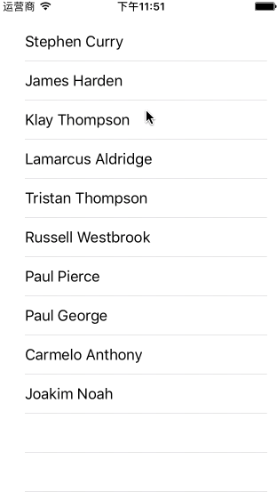
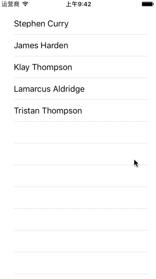
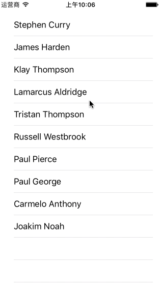

# TTPullRefreshView
##Description
This is a Simple pull refresh view you can play with. At the first beginning, I am mean to design a pull refresh view with a convenient usage in a project. In addition, it should have several layout styles to be used, which gives diverse appearance of the refresh view.
By the way, TTPullRefreshView is only perfectly supporting UITableView so far. But its final goal is to support both UITableView and UICollectionView (ps:If the width of your collection view's content size is not bigger than the screen width, TTPullRefreshView will work fine too: )).
##Import
##Cocoapods
//cocoapods  ... 这个想办法弄一弄
##Directly import TTPullRefreshView
You can download the repository, and simply drag the TTPullRefreshView class into your project. (It's all in one class. Maybe it'll not have a good design pattern, and you are welcome to give me some advice.)
##Customize your own pull refresh view
Simply import the TTPullRefreshView header file like below:
`#import "TTPullRefreshView.h" `
and there you go.
###Add it up!
Use three lines of code below to setup a basic version of TTPullRefreshView:
<pre>
<code>
TTPullRefreshView *refreshView = [TTPullRefreshView defaultRefreshView];
[refreshView setTarget:self action:@selector(refreshHandler:)];
_tableView.refreshView = refreshView;
</code>
</pre>
Here's a basic TTPullRefreshView looks like:

And its response is based on the target-action mechanism.
###Tittles
Use the `titles` property to add some titles to TTPullRefreshView. `titles` is an array. So when you add several strings into it, it will setup some labels for the strings in titles vertically.
Therefore, if I use the code:
`refreshView.titles = @[@"正在努力刷新...", @"2016-09-08 17:25"];`
to add two titles, TTPullRefreshView will look like this:

####Font size and text color
TTPullRefreshView allows you to set font size and color of both title and subtitle, and because of a frame calculation issue, it's not supporting attributed 
string yet.
Setting font size:
`[refreshView setTitleFontSize:16.0f];
 [refreshView setSubTitleFontSize:12.0f];`
Setting text color:
`[refreshView setTitleColor:[UIColor grayColor]];
 [refreshView setSubTitleColor:[UIColor blueColor]];`
And in my configuration, the first title is the main title-.-, the others are subtitles. Thus when you add the code above, TTPullRefreshView will become:

###Guiding text
There'll be some states for TTPullRefreshView in its pull refreshing period.
It's an enum called TTPullRefreshState, and its definition is:
<pre>
<code>
	typedef NS_ENUM(NSInteger, TTPullRefreshState) {
	    TTPullRefreshStateNone,
	    TTPullRefreshStatePullToRefresh,
	    TTPullRefreshStateLooseToRefresh,
	    TTPullRefreshStateRefreshing,
	    TTPullRefreshStateFinished
	};
</code>
</pre>
For purpose of setting different guiding texts at different states, I add an API to TTPullRefreshView as:
<pre>
<code>
	- (void)setGuidingText:(NSString *)guidingText forState:(TTPullRefreshState)state;
</code>
</pre>
So when you add code like below, TTPullRefreshView will be more alive :). 
<pre>
<code>
	[refreshView setGuidingText:@"刷新完成" forState:TTPullRefreshStateFinished];
	[refreshView setGuidingText:@"下拉刷新" forState:TTPullRefreshStatePullToRefresh];
	[refreshView setGuidingText:@"松手刷新" forState:TTPullRefreshStateLooseToRefresh];
</code>
</pre>
Here's the effect:

ps:The 'setGuidingText:forState:' API only supports 'TTPullRefreshStatePullToRefresh','TTPullRefreshStateLooseToRefresh', 'TTPullRefreshStateFinished' now. Please don't set guiding text at refreshing state or none state.
###Now change its layout style!
TTPullRefreshView has a property named 'layoutType'. It's for changing the appearance of the pull refresh view. It's an enum called TTPullRefreshLayoutType.
<pre>
<code>
typedef NS_ENUM(NSInteger, TTPullRefreshLayoutType) {
    TTPullRefreshLayoutLeft,
    TTPullRefreshLayoutRight,
    TTPullRefreshLayoutTop,
    TTPullRefreshLayoutBottom
};
</pre>
</code>
As you can see, it has four attributes. Each of them will control the indicator's location. By default, TTPullRefreshView is set to TTPullRefreshLayoutTop layout type. So when you go to set the layoutType property to 'TTPullRefreshLayoutLeft'. Its appearance will become:

###Change the indicator:
The indicator is actually a UIImageView, and it'll have a spinning animation while refreshing. =.=So it only supports those indicators which will work fine with spinning animation. If you want to change it, use the 'indicatorView' property.
###Finished
Last but not least, you should call `-(void)finished;` when you finished your refreshing assignment.
##Explanation and warning //找到新方法了。。这个可能可以不用了~
In this project, I write a UIScrollView category to make pull refresh view conveniently added on top of the scroll view. Thus you won't need to change the structure of your table view. However, using this methodology, I can't get delegate of the scroll view in TTPullRefreshView. Because of this, I have to use KVO to monitor `contentOffset` of the scroll view to imitate a `-(void)scrollViewDidScroll`. There comes an obstacle while I am trying to imitate a `-(void)scrollViewDidEndDragging` method. Because the `dragging` property doesn't have a setter, you can't use KVO mechanism on it. 

